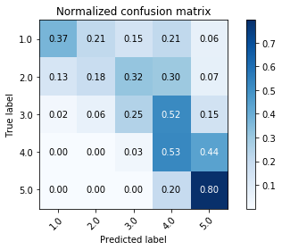

# ImprovingYelp
The full paper for this project can be downloaded [here](https://scholar.smu.edu/datasciencereview/vol2/iss1/13/).

There are two purposes to this project. 
1. Try to predict the user rating of a restaurant using the text of their review.
2. Use the text from reviews for a restaurant or a cuisine to identify high-quality items on the menu. 

### Data

Data is from [Yelp Dataset Challenge](https://www.yelp.com/dataset/challenge)

Data Cleaning found in DataCleaning.ipynb. .py files containing individual steps can be found in the processing folder.

Data Cleaning Pipeline:

number_reviews.py -> sent_analysis.py -> merge_sents.py -> to_dummy.py -> sparse_yelp_reviews

### Methodology

Preparing the data for analysis took a few steps. First was getting the sentiment scores for each review using VADER. The second was one-hot encoding all categorical variables. Finally, each text review was turned into a TF-IDF vector. All of these features were then used to predict user rating for given reviews using a variety of machine learning algorithms, including Naive Bayes, Support Vector Machines, logistic regression, and XGBoost. Only logistic regression and XGBoost are discussed in the paper, as they are the two best performing methods.

Because of its interpretability and performance, logistic regression was then used to identify n-grams that were associated strongly with high ratings. Important bigrams turned out to not be informative, while important trigrams yielded some important information, including menu items.

### Results

With respect to purpose 1, this project was largely successful. It produced predictions with RMSEs comparable to other top papers using more complicated methods such as RNNs. One weakness of this model is in predicting reviews between 2-4 stars. It appears that there is very little difference between your average 4 star review and a 5 star review, as well as 2 stars compared to 1.

Full results can be found in the paper above.

### To Improve

This methodology could be most easily improved using data from the restaurants' menu. This data could be used in conjunction with the important trigrams to automatically identify menu items and remove uninformative trigrams. Yelp does have information on a restaurant's menu, but it is not part of the publicly available dataset. Yelp also does not allow scraping of their website. 
